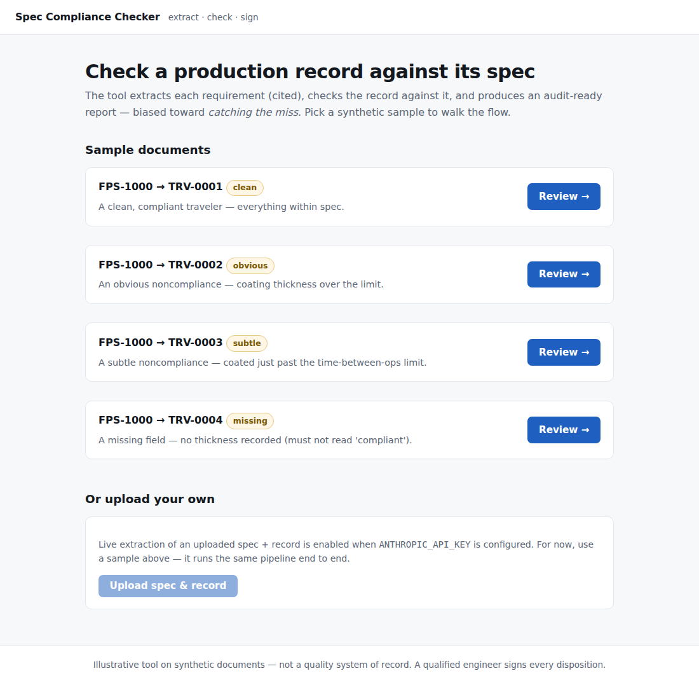
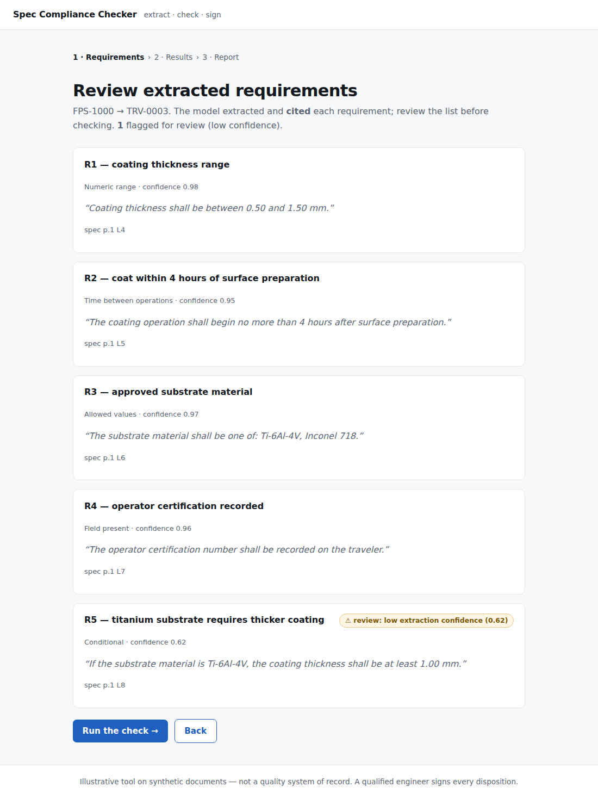
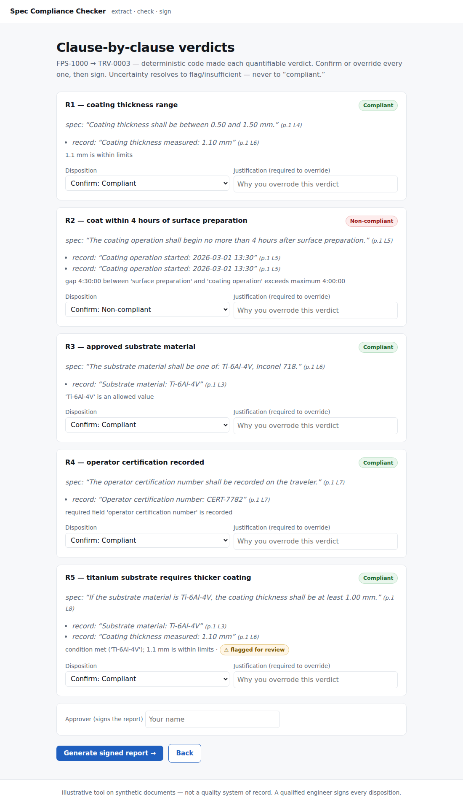
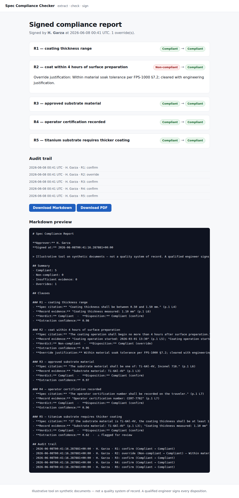

# Spec Compliance Checker

Pick (or upload) a process spec and a production record; it extracts each requirement (cited), checks the record against it, and produces an audit-ready report — deliberately biased toward *catching the miss*, because a false negative is an audit finding and a false positive is five minutes of an engineer's time.

> **Illustrative tool on synthetic documents — not a quality system of record; a qualified engineer signs every disposition.**

Part of [hector-garza.com](https://hector-garza.com)'s portfolio. One of three equal deliverables: the app, a **Decision Record** ([`DECISIONS.md`](./DECISIONS.md)), and a recorded whiteboard session. A working demo no longer proves competence — the judgment behind it does. See [`SPEC.md`](./SPEC.md) §0.

## What it does
- Extracts discrete, **typed, cited** requirements from a spec (numeric range, temporal/time-between-ops, categorical, presence, conditional).
- Checks each against the production record → **Compliant / Non-compliant / Insufficient evidence.**
- **Deterministic code makes the numeric/temporal verdicts; the LLM only extracts and cites** — so a model never does arithmetic on safety numbers.
- A missing field is **never** "compliant." A human confirms or overrides every verdict (overrides need a justification); audit-ready report exports to Markdown/PDF with approver + timestamp and a full audit trail.

## The design in one line
**The model extracts and cites. Deterministic code decides. A qualified engineer signs.**

That split is the whole point. The LLM is confined to *understanding* — pulling each requirement out of the spec with a verbatim citation, and finding the matching value in the record with a verbatim citation. Every pass/fail call on anything quantifiable is made by deterministic, unit-tested code. The hallucination surface shrinks to "did it quote the requirement correctly," which the engineer's review gate catches — rather than trusting a model to do arithmetic on safety-relevant numbers. Uncertainty resolves to *flag / insufficient evidence*, never to *compliant*.

## Screenshots

| Pick a sample | Review extracted requirements |
|---|---|
|  |  |

| Clause-by-clause verdicts | Signed report + audit trail |
|---|---|
|  |  |

The `coating-subtle` sample shows the catch the tool exists for: coating applied 4 h 30 m after surface prep — 30 minutes past the 4-hour limit — flagged **Non-compliant**, while `coating-missing` (no thickness recorded) reads **Insufficient evidence**, never "compliant."

## Tech stack
- **Backend:** Django 5.2 (Python 3.12)
- **AI:** Anthropic SDK (Claude) — structured, cited requirement extraction via `messages.parse` (not verdicts), prompt caching
- **Docs:** `pdfplumber` (primary) / `pypdf` (fallback) for typed/text PDFs
- **Frontend:** Django templates + HTMX
- **Report:** Markdown + PDF (`reportlab`)
- **Packaging:** Docker · **Quality:** pytest + ruff + GitHub Actions CI

## Run locally
With Docker (one command):
```bash
docker build -t scc . && docker run --rm -p 8000:8000 -e DJANGO_SECRET_KEY=dev scc
# → http://localhost:8000
```

Or with a virtualenv:
```bash
python -m venv .venv && . .venv/bin/activate
pip install -e ".[dev]"
cp .env.example .env          # then edit as needed
python manage.py runserver    # → http://localhost:8000
pytest                        # run the tests (100, API mocked)
ruff check .                  # lint
```

The four **sample** documents run the full pipeline **offline** (canned model output) — no API key needed. To analyze your **own** uploaded spec + record, set `ANTHROPIC_API_KEY` (see below); that enables the live extraction path.

## Deployment
Dockerized Django on **Render**, fronted by **Cloudflare** (planned subdomain `compliance.hector-garza.com`).

1. Push to GitHub, then in Render: **New → Blueprint** and point it at this repo. [`render.yaml`](./render.yaml) provisions a Docker web service with `/healthz` health checks and the right env vars.
2. Set **`ANTHROPIC_API_KEY`** as a secret in the Render dashboard (`render.yaml` marks it `sync: false` so it's never committed).
3. The container binds Render's `$PORT`, runs `gunicorn`, and serves static assets via `whitenoise` (collected at build).

Key env vars (see [`.env.example`](./.env.example)): `DJANGO_SECRET_KEY`, `DJANGO_DEBUG`, `DJANGO_ALLOWED_HOSTS`, `DJANGO_CSRF_TRUSTED_ORIGINS`, `ANTHROPIC_API_KEY`, `ANTHROPIC_MODEL`. **`ANTHROPIC_API_KEY` is never committed** (`.env` is gitignored; the host holds the secret). Cost guard: one extraction call per spec + one per record, prompt-cached, with a token cap.

## Links
- 🔗 Live demo: _TBD (deploy via `render.yaml`)_
- 🧠 Decision record: [`DECISIONS.md`](./DECISIONS.md)
- 🎥 Whiteboard walkthrough: _TBD (M9)_

## How it's built
See [`PLAN.md`](./PLAN.md) — M0 → M9. The deterministic verdict logic (incl. the missing-field → insufficient-evidence invariant) was built **first** and hardest-tested; the cited extraction layer, the review gate, and the UI go on top. Decisions are recorded as built in [`DECISIONS.md`](./DECISIONS.md).
